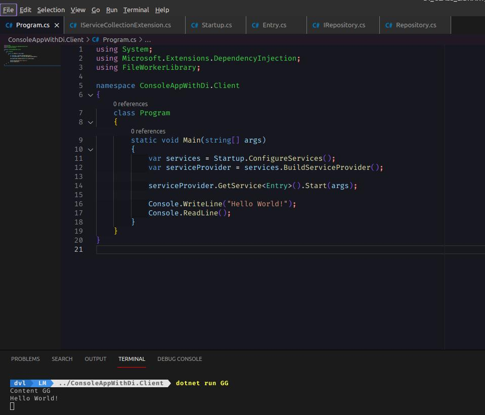

# DOTNET(C#) DI FOR LIBRARY MICROEXAMPLE

Just a simple example that shows wiring of a DI for a custom library

    

Microsoft Dependency Injection is used as a container.  
If you need to have DI in a custom library you could go with the example shown in repo.  
For this example a solution with 2 projects are made, that consist of the "project" client that uses a custom library and library itself.

Also if desired you can do all services addings in the startup class if you dont wish to add reference of Microsoft Dependency Injection to custom library.

Thanks 😊 👍
